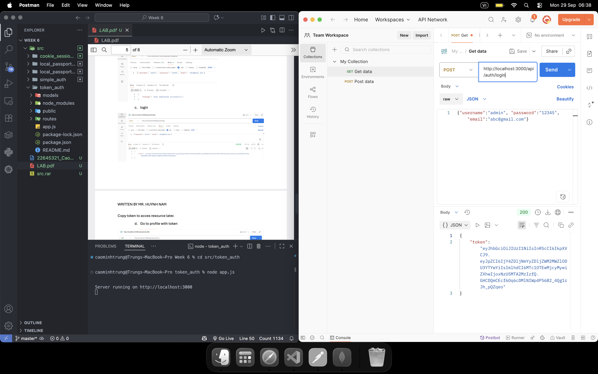
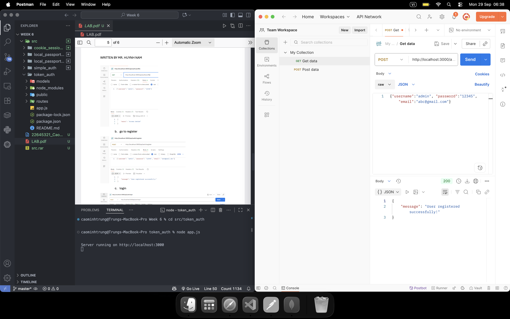
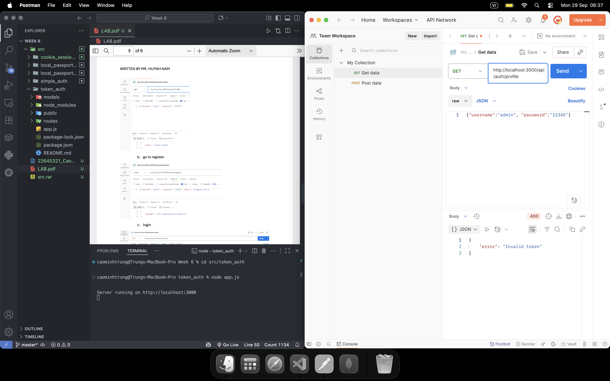
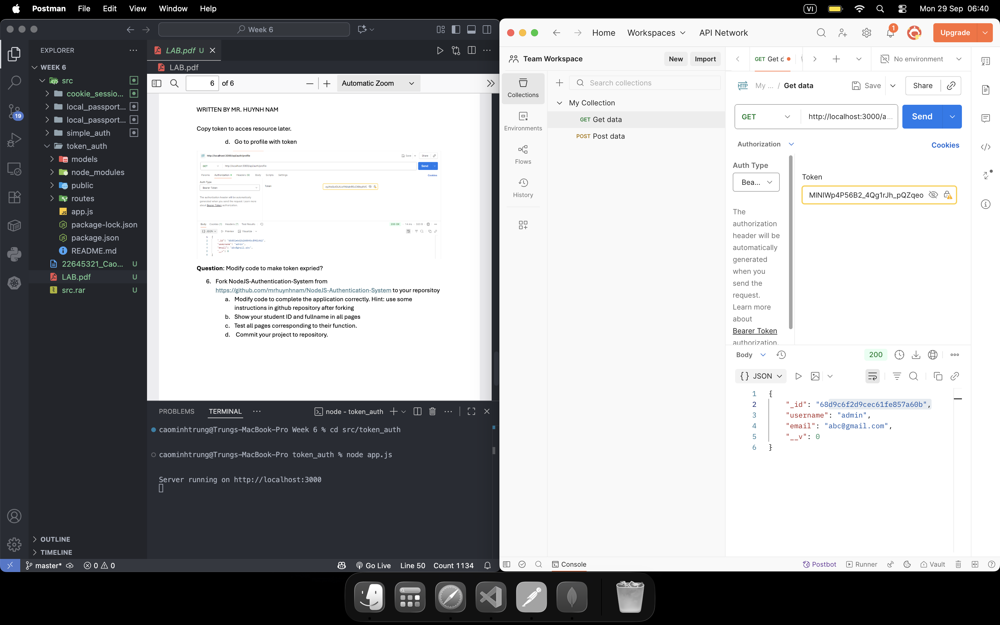
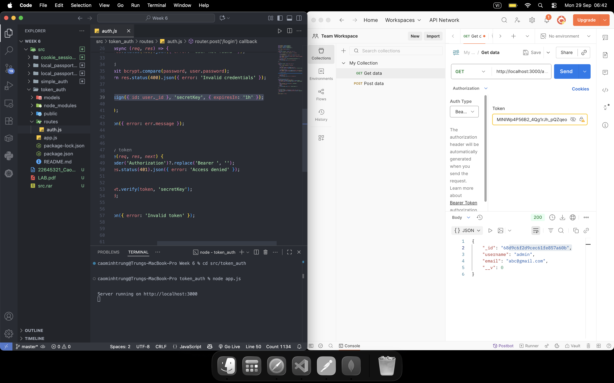

# Token Auth

This project demonstrates authentication using tokens (such as JWT) in Node.js and Express. It includes user registration, login, and token-based authentication features.

## Features

- Token-based authentication (e.g., JWT)
- User registration and login
- Example user model

## Getting Started

1. Install dependencies:
   ```bash
   npm install
   ```
2. Start the server:
   ```bash
   node app.js
   ```
3. Access the app at `http://localhost:3000`

## Project Structure

- `app.js`: Main application file
- `models/User.js`: User model
- `routes/auth.js`: Authentication routes
- `package.json`: Project dependencies

## License

## Results

Below are screenshots from the `public/results` folder:

### Login



### Register



### Profile



### Token



### Modify Code



To modify code to make token expried, we will change a line:

```
consttoken = jwt.sign({ id:user._id }, 'secretKey', { expiresIn:'1h' });
```

MIT
